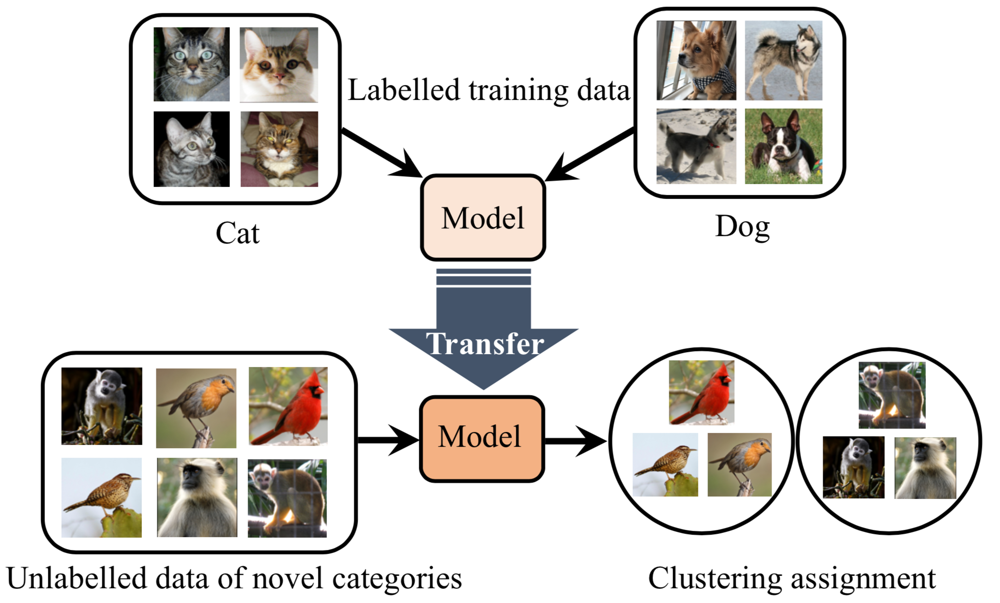

# DTC

**[Learning to Discover Novel Visual Categories via Deep Transfer Clustering, ICCV 2019](http://www.robots.ox.ac.uk/~vgg/research/DTC/)**,
<br>
[Kai Han](http://www.hankai.org), [Andrea Vedaldi](http://www.robots.ox.ac.uk/~vedaldi/), [Andrew Zisserman](http://www.robots.ox.ac.uk/~az/)
<br>

<p align="center">
    
</p>

## Dependencies
- Python (version=2.7.15)
- PyTorch (version=1.0.1)
- Numpy (version=1.15.4)
- scikit-learn (version=0.20.1)
- tqdm (version=4.28.1)

## Overview
We provide code and models for all our experiments on ImageNet, OmniGlot, CIFAR-100, CIFAR-10, and SVHN:
- Pretrained initialization models with supervised learning
- Trained models of deep transfer clustering (DTC)
- Supervised pretraining code
- DTC code 
- Novel category number estimation code

## Data preparation
By default, we put the data in `./data/datasets/` (soft link is suggested). You may also use any path you like by setting the `--dataset_root` argument to `/your/path/`.

- For CIFAR-10, CIFAR-100, and SVHN, simply download the datasets and put into `./data/datasets/`.
- For OmniGlot, after downloading, you need to put `Alphabet_of_the_Magi, Japanese_(katakana), Latin, Cyrillic, Grantha` from  `imags_background` folder into `images_background_val` folder, and put the rest alphabets into `images_background_train` folder.
- For ImageNet, we provide the exact split files used in the experiment following existing work. To download the split files, run the command:

```shell
sh scripts/download_imagenet_splits.sh
```

## Pretrained models

We provide all our pretrained models (supervised initialization models + DTC models) (~13G). To download, run the command:

```shell
sh scripts/download_pretrained_models.sh
```

Note that our results on all datasets are averaged over 10 runs, except ImageNet, which is averaged over 3 runs using different unlabelled subsets following existing work. All our trained models are provided and the detailed results of each run are also included in the `.txt` files in each subfolder. 

## Initialization (supervised learning with labelled data)
We provide our pretrained initialization models used in our DTC experiments. 
If you have downloaded all our pretrained models by running `sh scripts/download_pretrained_models.sh`, the pretrained initialization models are placed in `./data/experiments/pretrained`. Alternatively, if you only want to download the initialization models (~236M) and do not need the pretrained DTC models, run the command:

```shell
sh scripts/download_init_pretrained.sh
```

If you would like to train the initialization model with labelled data, run the commands:

```shell
# Train CIFAR-10 with the 5 labelled classes
CUDA_VISIBLE_DEVICES=0 python cifar10_classif.py 

# Train CIFAR-100 with the 80 labelled classes
CUDA_VISIBLE_DEVICES=0 python cifar100_classif.py 

# Train SVHN with the 5 labelled classes
CUDA_VISIBLE_DEVICES=0 python svhn_classif.py 

# Train ImageNet with the 800 labelled classes
CUDA_VISIBLE_DEVICES=0 python imagenet_classif.py

# Train OmniGlot with the labelled classes with prototypical loss
CUDA_VISIBLE_DEVICES=0 python omniglot_proto.py
```


## DTC training (known number of novel categories) 
After having the supervised pretrained model (initialization of DTC), you could run the DTC code on unlabelled data of novel categories. To reproduce exactly the same numbers as in our paper, you are suggested to use the pretrained initialization models downloaded above. 

To train the DTC model on CIFAR-10, run the commands:

```shell
# Single run demo (DTC-PI)
CUDA_VISIBLE_DEVICES=0 python cifar10_DTC.py 

# Train DTC-Baseline 10 runs
CUDA_VISIBLE_DEVICES=0 sh scripts/cifar10_DTC_Baseline_10runs.sh

# Train DTC-PI 10 runs
CUDA_VISIBLE_DEVICES=0 sh scripts/cifar10_DTC_PI_10runs.sh

# Train DTC-TE 10 runs
CUDA_VISIBLE_DEVICES=0 sh scripts/cifar10_DTC_TE_10runs.sh

# Train DTC-TEP 10 runs
CUDA_VISIBLE_DEVICES=0 sh scripts/cifar10_DTC_TEP_10runs.sh
```

To train DTC model on other datasets, i.e., ImageNet, OmniGlot, CIFAR-100, and SVHN, just replace `cifar10` in the above commands by `imagenet`, `omniglot`, `cifar100`, and `svhn`. For experiments of transferring from ImageNet to CIFAR-10, replace `cifar10` in the above commands by `imagenet2cifar`.

## Estimating the number of novel categories
To estimate the number of novel categories, run the commands:

```shell
# For OmniGlot 
CUDA_VISIBLE_DEVICES=0 python omniglot_est_k.py 

# For ImageNet subset A 
CUDA_VISIBLE_DEVICES=0 python imagenet_est_k.py --subset A 

# For ImageNet subset B 
CUDA_VISIBLE_DEVICES=0 python imagenet_est_k.py --subset B 

# For ImageNet subset C 
CUDA_VISIBLE_DEVICES=0 python imagenet_est_k.py --subset C 

# For CIFAR-100 
CUDA_VISIBLE_DEVICES=0 python cifar100_est_k.py 
```

## DTC training (unknown number of novel categories)
```shell
# Single run demo on OmniGlot 
CUDA_VISIBLE_DEVICES=0 python omniglot_DTC_unknown.py 

# OmniGlot 10 runs
CUDA_VISIBLE_DEVICES=0 sh scripts/omniglot_DTC_unknown_10runs.sh

# ImageNet subset A (using our estimated category numbers) 
CUDA_VISIBLE_DEVICES=0 python imagenet_DTC.py --subset A --n_clusters 34

# ImageNet subset B (using our estimated category numbers) 
CUDA_VISIBLE_DEVICES=0 python imagenet_DTC.py --subset B --n_clusters 31

# ImageNet subset C (using our estimated category numbers) 
CUDA_VISIBLE_DEVICES=0 python imagenet_DTC.py --subset C --n_clusters 32
```
## Citation
If this work is helpful for your research, please cite our paper.
```
@inproceedings{Han2019learning,
author    = {Kai Han and Andrea Vedaldi and Andrew Zisserman},
title     = {Learning to Discover Novel Visual Categories via Deep Transfer Clustering},
booktitle = {International Conference on Computer Vision (ICCV)},
date      = {2019}
}
```

## Acknowledgments
We are grateful to [EPSRC Programme Grant Seebibyte EP/M013774/1](http://seebibyte.org/) and [ERC StG IDIU-638009](https://cordis.europa.eu/project/rcn/196773/factsheet/en) for support.


